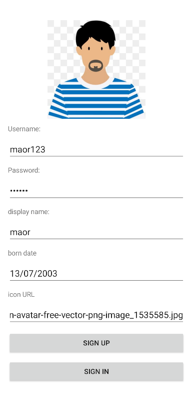
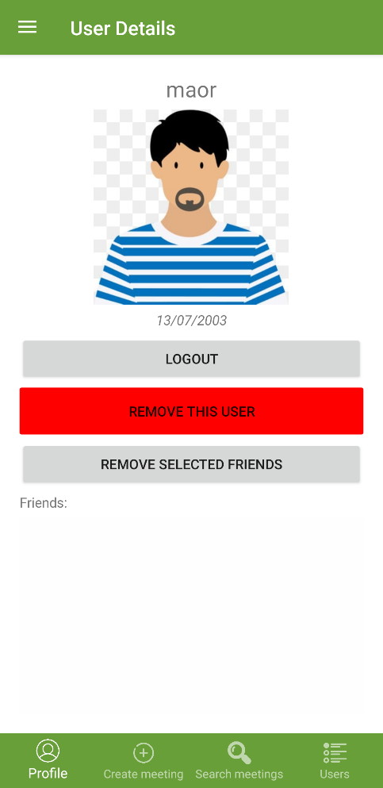
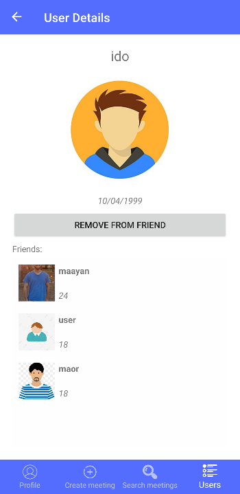
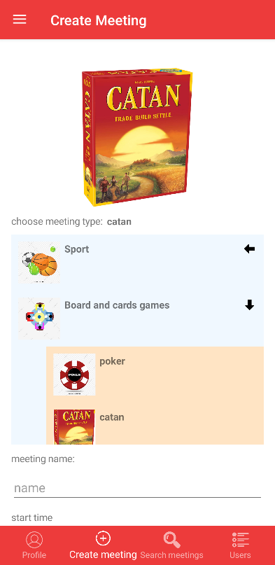
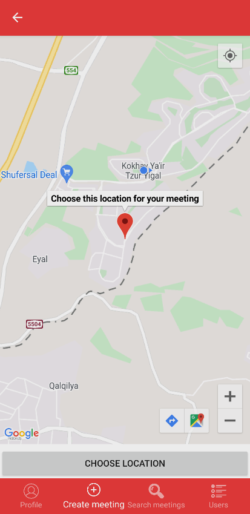
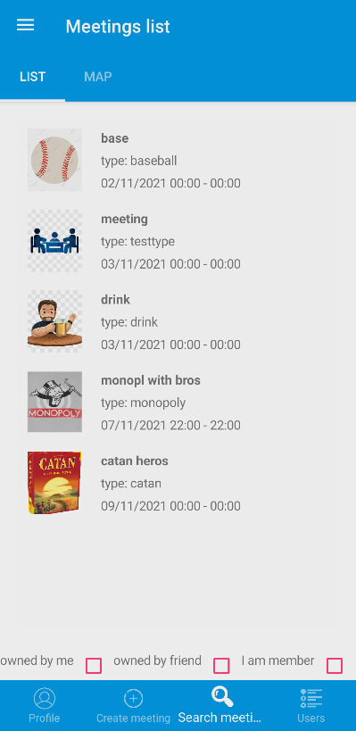
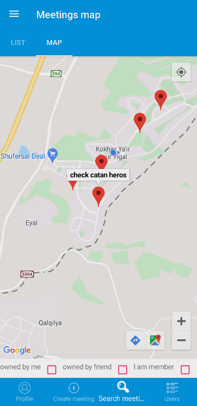
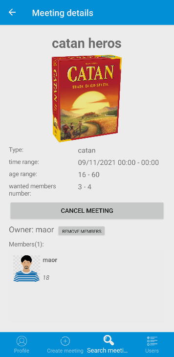

# Lets meet

This app was written for my final project for object oriented programming workshop, [Course #20586](https://docs.microsoft.com/xamarin/xamarin-forms/app-fundamentals/shell/), in the [open university of Israel](https://www-e.openu.ac.il/courses/20586.htm)

